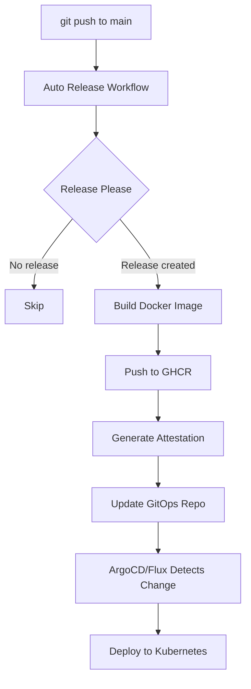

# Workflow Architecture

Este documento explica la arquitectura de workflows de CI/CD y por qué están diseñados de esta manera.

## 🎯 Principio de Diseño

**Un build por release, múltiples destinos.**

Cada release debe construir la imagen Docker **una sola vez** y luego distribuirla a diferentes destinos (GHCR, GitOps, etc.). Esto asegura:
- ✅ Consistencia: misma imagen en todos los ambientes
- ✅ Velocidad: no rebuilds innecesarios
- ✅ Ahorro de recursos: menos tiempo de CI/CD
- ✅ Trazabilidad: un digest por release

## 📊 Flujo Completo



## 🔧 Workflows

### 1. Auto Release (`auto-release.yml`) - ⭐ Principal

**Trigger:** Push a `main`

**Responsabilidades:**
- Gestiona releases con Release Please
- **Build de imagen Docker** (una sola vez)
- Push a GitHub Container Registry
- Genera attestation de provenance
- **Actualiza GitOps repository**

**Jobs:**
1. `release` - Release Please crea/actualiza PR de release
2. `build-and-push` - Build y push de imagen (solo si hay release)
3. `update-helm-chart` - Actualiza y publica Helm chart con versión sincronizada
4. `update-gitops` - Actualiza values-staging.yaml en gitops-cf

**Por qué es el principal:**
- Todo sucede en un solo workflow
- Un solo build por release
- Jobs paralelos donde es posible
- Flujo automático completo

### 2. CI (`ci.yml`) - Testing

**Trigger:** Push, Pull Requests

**Responsabilidades:**
- Tests unitarios
- Linting
- Build verification (sin push)

**No hace:**
- ❌ Push de imágenes
- ❌ Releases
- ❌ Deploy

### 3. Build and Push (`docker-build.yml`) - Desarrollo

**Trigger:** Push a `main`/`develop`, Manual

**Responsabilidades:**
- Build de imágenes de desarrollo
- Tags: `main`, `develop`, `sha-abc123`

**No hace:**
- ❌ Releases versionados
- ❌ Tag `latest` (reservado para releases)
- ❌ GitOps updates

### 4. Release (`release.yml`) - ⚠️ DEPRECATED

**Status:** Solo para testing manual

**Trigger:** Manual solamente (`workflow_dispatch`)

**Cuándo usar:**
- Testing de GitOps sin crear release
- Re-build manual de una versión específica
- Debugging

**Opciones:**
- `tag`: Tag a procesar (ej: v1.2.0)
- `skip_build`: Solo actualizar GitOps (default: false)

**Por qué está deprecado:**
- Auto Release ya hace todo automáticamente
- Evita duplicación de builds
- Mantiene flujo centralizado

### 5. Helm Release (`helm-release.yml`) - Helm Charts

**Trigger:** Cambios en `helm/**`

**Responsabilidades:**
- Package Helm chart
- Push a OCI registry (GHCR)
- Create GitHub release para el chart

**Independiente de:**
- App releases
- Docker builds

## 🚫 Anti-Patrones Evitados

### ❌ Build Duplicado (Antes)

```
Release Please crea release
  → Auto Release: Build imagen v1.2.0 ✅
  → Release evento: Build imagen v1.2.0 OTRA VEZ ❌
```

**Problema:**
- Dos builds idénticos
- Desperdicio de recursos
- Posible inconsistencia (diferentes timestamps, capas)

### ✅ Build Único (Ahora)

```
Release Please crea release
  → Auto Release:
      1. Build imagen v1.2.0 ✅
      2. Push a GHCR ✅
      3. Update GitOps ✅
```

**Beneficios:**
- Un solo build por release
- Todo en un workflow
- Atomic operation

## 🔄 Comparación: Antes vs Ahora

### Antes (Con duplicación)

| Paso | Workflow | Tiempo | Build |
|------|----------|--------|-------|
| 1. Merge PR | Auto Release | 2min | ✅ Build v1.2.0 |
| 2. Release published | Release | 2min | ❌ Build v1.2.0 (duplicado) |
| 3. Update GitOps | Release | 10s | - |
| **TOTAL** | **2 workflows** | **~4min** | **2 builds** |

### Ahora (Sin duplicación)

| Paso | Workflow | Tiempo | Build |
|------|----------|--------|-------|
| 1. Merge PR | Auto Release | 2min | ✅ Build v1.2.0 |
| 2. Update GitOps | Auto Release | 10s | - |
| **TOTAL** | **1 workflow** | **~2min** | **1 build** |

**Mejora: 50% más rápido, 50% menos builds**

## 🎨 Diseño de Jobs en Auto Release

```yaml
jobs:
  release:
    # Release Please - crea release si es necesario
    outputs:
      release_created: true/false
      version: "1.2.0"

  build-and-push:
    needs: release
    if: release_created == 'true'
    # Solo se ejecuta si hay release
    # Build + Push + Attestation

  update-helm-chart:
    needs: [release, build-and-push]
    if: release_created == 'true'
    # Actualiza Chart.yaml con nueva versión
    # Package y push del Helm chart a OCI

  update-gitops:
    needs: [release, build-and-push, update-helm-chart]
    if: release_created == 'true'
    # Solo se ejecuta después del build y chart exitosos
    # Actualiza gitops-cf con nueva versión
```

**Características:**
- Jobs condicionales (`if: release_created`)
- Dependencias claras (`needs`)
- Fail-fast: si build falla, no actualiza GitOps
- Parallel donde es posible

## 🧪 Testing del Flujo

### Test 1: Release Normal

```bash
# 1. Hacer commit con conventional commit
git commit -m "feat: nueva funcionalidad"
git push origin main

# 2. Release Please abre/actualiza PR automáticamente
# 3. Merge PR

# 4. Verificar Auto Release workflow
gh run list --workflow=auto-release.yml --limit 1

# 5. Verificar que corrió todos los jobs
gh run view <run-id>
# ✓ Create Release
# ✓ Build and Push Release Image
# ✓ Update GitOps Repository

# 6. Verificar GitOps
gh api repos/parraletz/gitops-cf/commits --jq '.[0].commit.message'
# Debe mostrar: "chore(books-api): update image tag to 1.2.0"
```

### Test 2: Testing Manual (sin crear release)

```bash
# Usar el workflow deprecado solo para testing
gh workflow run "Release (Manual Testing)" \
  -f tag=v1.2.0 \
  -f skip_build=true

# Esto solo actualiza GitOps sin rebuild
```

## 📋 Checklist de Release

Cuando se hace un release, Auto Release ejecuta:

- [x] Release Please crea release en GitHub
- [x] Build imagen Docker multi-arch (amd64, arm64)
- [x] Push a GHCR con tags:
  - `ghcr.io/parraletz/books-api:1.2.0`
  - `ghcr.io/parraletz/books-api:latest`
- [x] Genera attestation de provenance
- [x] Actualiza versión del Helm chart (Chart.yaml)
- [x] Package y push Helm chart a OCI:
  - `oci://ghcr.io/parraletz/charts/books-api:1.2.0`
- [x] Actualiza `gitops-cf/books/api/values-staging.yaml`
- [x] Commit y push a GitOps repo
- [ ] ArgoCD/Flux detecta cambio (automático)
- [ ] Deploy a Kubernetes (automático)

## 🔍 Debugging

### Ver por qué no se ejecutó un job

```bash
# Ver condiciones de jobs
gh run view <run-id> --json jobs --jq '.jobs[] | {name, conclusion, if}'

# Ver outputs del job de release
gh run view <run-id> --json jobs --jq '.jobs[] | select(.name == "Create Release") | .outputs'
```

### Verificar qué imagen se deployó

```bash
# En el cluster
kubectl get deployment books-api -o jsonpath='{.spec.template.spec.containers[0].image}'

# Comparar con GitOps
curl -s https://raw.githubusercontent.com/parraletz/gitops-cf/main/books/api/values-staging.yaml | grep "tag:"
```

## 🎯 Mejores Prácticas

1. **Un build por release**: Nunca rebuilds la misma versión
2. **Jobs condicionales**: Solo ejecuta lo necesario
3. **Fail-fast**: Si build falla, no continúa
4. **Idempotencia**: Re-ejecutar no causa problemas
5. **Trazabilidad**: Un digest de imagen por versión
6. **Separación de concerns**: Cada workflow tiene un propósito claro

## 🚀 Evolución Futura

Posibles mejoras:

1. **Multi-environment GitOps**
   - Actualizar values-staging.yaml automáticamente
   - Actualizar values-production.yaml manualmente o con aprobación

2. **Rollback automático**
   - Si deploy falla, revertir GitOps commit

3. **Notificaciones**
   - Slack/Discord cuando se hace deploy
   - Alertas si workflow falla

4. **Métricas**
   - Tiempo de build por versión
   - Tiempo de deploy
   - Success rate

## 📚 Referencias

- [Release Please](https://github.com/googleapis/release-please)
- [Docker Build Push Action](https://github.com/docker/build-push-action)
- [Build Provenance Attestation](https://github.com/actions/attest-build-provenance)
- [GitOps Principles](https://opengitops.dev/)
