# ✅ Configuración Completa - Books API

Este documento resume toda la configuración del proyecto.

## 🎉 ¿Qué se ha configurado?

### 1. Docker & Containerización

#### Desarrollo
- ✅ **Dockerfile.dev** - Imagen para desarrollo
- ✅ **docker-compose.yml** - Stack completo:
  - API con hot-reload
  - PostgreSQL con datos de ejemplo
  - Redis para caché
  - Adminer (UI de PostgreSQL)
  - Redis Commander (UI de Redis)
- ✅ **init-db/** - Scripts de inicialización de BD

#### Producción
- ✅ **Dockerfile** - Multi-stage optimizado:
  - Usuario no-root
  - Solo dependencias de producción
  - Health checks
  - Imagen Alpine (ligera)
- ✅ **.dockerignore** - Optimización de build

### 2. CI/CD con GitHub Actions

#### Workflows configurados:

1. **auto-release.yml** ⭐ - Releases automáticos
   - Analiza commits con Conventional Commits
   - Crea PRs con nueva versión y CHANGELOG
   - Publica imágenes Docker al mergear

2. **docker-build.yml** - Build de imágenes
   - Push a main/develop → publica imagen
   - Multi-plataforma (amd64, arm64)
   - Attestation de provenance

3. **ci.yml** - Tests y validación
   - Ejecuta tests
   - Valida build de Docker
   - Verifica que la app inicie

4. **release.yml** - Release manual (deprecado)

### 3. Sistema de Releases Automáticos

- ✅ **Release Please** - Versionado semántico automático
- ✅ **Conventional Commits** - Formato estándar de commits
- ✅ **Husky** - Validación automática de commits
- ✅ **Commitlint** - Reglas de validación

**Flujo:**
```
Commit (feat/fix) → Push → PR automático → Merge → Release + Docker images
```

### 4. Validación de Commits (Husky)

- ✅ **commit-msg hook** - Valida formato de commits
- ✅ **pre-commit hook** - Checks antes de commit
- ✅ **Configuración inteligente** - Solo en desarrollo, no en producción

### 5. Documentación

| Archivo | Propósito |
|---------|-----------|
| [README.md](README.md) | Documentación principal |
| [CONTRIBUTING.md](CONTRIBUTING.md) | Guía de contribución completa |
| [RELEASES.md](RELEASES.md) | Sistema de releases automáticos |
| [README.Docker.md](README.Docker.md) | Guía de Docker |
| [DEPLOYMENT.md](DEPLOYMENT.md) | Guía de despliegue en múltiples plataformas |
| [CHANGELOG.md](CHANGELOG.md) | Historial de cambios (auto-generado) |
| [.github/COMMIT_CONVENTION.md](.github/COMMIT_CONVENTION.md) | Referencia rápida de commits |
| [.github/SETUP_RELEASE_PLEASE.md](.github/SETUP_RELEASE_PLEASE.md) | Configuración de Release Please |
| [.github/workflows/README.md](.github/workflows/README.md) | Documentación de workflows |
| [.husky/README.md](.husky/README.md) | Documentación de Git hooks |

## 🚀 Inicio Rápido

### Para Desarrolladores

```bash
# 1. Clonar
git clone https://github.com/parraletz/books-api.git
cd books-api

# 2. Instalar dependencias (instala Husky automáticamente)
bun install

# 3. Iniciar desarrollo
bun run dev

# O con Docker (stack completo)
bun run docker:dev
```

### Para Producción

```bash
# Desde GitHub Container Registry
docker pull ghcr.io/parraletz/books-api:latest
docker run -p 3000:3000 ghcr.io/parraletz/books-api:latest

# O build local
docker build -t books-api:latest .
docker run -p 3000:3000 books-api:latest
```

## 📋 Convenciones de Commits

```bash
# Nueva funcionalidad (MINOR: 1.0.0 → 1.1.0)
git commit -m "feat: add user authentication"

# Bug fix (PATCH: 1.0.0 → 1.0.1)
git commit -m "fix: resolve memory leak"

# Breaking change (MAJOR: 1.0.0 → 2.0.0)
git commit -m "feat!: redesign API endpoints"

# Otros (no generan release)
git commit -m "docs: update README"
git commit -m "chore: update dependencies"
```

**Validación:** Husky rechazará commits con formato incorrecto.

## 🔧 Configuración Pendiente (Primera vez)

### 1. Habilitar Release Please

Para que Release Please pueda crear PRs automáticamente:

1. Ve a **Settings** → **Actions** → **General**
2. En "Workflow permissions":
   - ✅ Selecciona "Read and write permissions"
   - ✅ Marca "Allow GitHub Actions to create and approve pull requests"
3. Click en **Save**

Ver guía completa: [.github/SETUP_RELEASE_PLEASE.md](.github/SETUP_RELEASE_PLEASE.md)

### 2. Hacer el paquete público (Opcional)

Para que las imágenes Docker sean públicas:

1. Ve a GitHub → **Packages** → `books-api`
2. **Package settings** → **Change visibility** → **Public**

## 📊 Flujo de Trabajo

### Desarrollo Normal

```mermaid
graph LR
    A[Desarrollar] --> B[git commit -m feat: ...]
    B --> C[Husky valida]
    C --> D[git push]
    D --> E[CI tests]
    E --> F[Release Please crea PR]
    F --> G[Revisar PR]
    G --> H[Mergear PR]
    H --> I[Release automático]
    I --> J[Docker images publicadas]
```



### Versionado

| Tipo de commit | Versión anterior | Nueva versión | Razón |
|----------------|------------------|---------------|-------|
| `fix: bug` | 1.2.3 | **1.2.4** | PATCH |
| `feat: feature` | 1.2.3 | **1.3.0** | MINOR |
| `feat!: breaking` | 1.2.3 | **2.0.0** | MAJOR |
| `docs: update` | 1.2.3 | 1.2.3 | Sin cambio |

## 🎯 Características Principales

### Desarrollo
- ✅ Hot-reload con Bun
- ✅ Stack completo con Docker Compose
- ✅ Base de datos con datos de ejemplo
- ✅ UIs para administrar BD y Redis
- ✅ Validación de commits automática

### CI/CD
- ✅ Tests automáticos en cada PR
- ✅ Build de imágenes multi-plataforma
- ✅ Releases automáticos con versionado semántico
- ✅ CHANGELOG generado automáticamente
- ✅ Attestation de provenance para seguridad

### Producción
- ✅ Imagen Docker optimizada (Alpine)
- ✅ Multi-stage build
- ✅ Health checks
- ✅ Usuario no-root
- ✅ Solo dependencias de producción
- ✅ Publicación automática en GHCR

## 🛠️ Scripts NPM/Bun

```bash
# Desarrollo
bun run dev                    # Servidor con hot-reload

# Docker - Desarrollo
bun run docker:dev             # Inicia stack completo
bun run docker:dev:build       # Rebuild e inicia
bun run docker:down            # Detiene servicios
bun run docker:logs            # Ver logs de la API

# Docker - Producción
bun run docker:prod:build      # Build imagen de producción
bun run docker:prod:run        # Ejecuta imagen de producción
```

## 📦 Dependencias

### Producción
- **hono** - Framework web

### Desarrollo
- **@types/bun** - Types para Bun
- **husky** - Git hooks
- **@commitlint/cli** - Validación de commits
- **@commitlint/config-conventional** - Reglas conventional commits

## 🔐 Seguridad

- ✅ Usuario no-root en contenedores
- ✅ Attestation de provenance en imágenes
- ✅ Multi-stage builds (reduce superficie de ataque)
- ✅ Solo dependencias necesarias en producción
- ✅ Health checks configurados
- ✅ .dockerignore para excluir archivos sensibles

## 📈 Próximos Pasos

1. **Configurar Release Please** (ver sección arriba)
2. **Hacer primer commit con conventional commits:**
   ```bash
   git commit -m "feat: initial release setup"
   git push origin main
   ```
3. **Esperar PR de Release Please**
4. **Mergear PR → primer release automático**
5. **Desarrollar features con conventional commits**

## 🆘 Troubleshooting

### Husky no funciona
```bash
bunx husky install
```

### Release Please no crea PRs
- Verifica permisos en Settings → Actions
- Lee [.github/SETUP_RELEASE_PLEASE.md](.github/SETUP_RELEASE_PLEASE.md)

### Docker build falla
```bash
# Verificar que Husky se omite en producción
cat package.json | grep prepare
# Debe mostrar: "[ -d .git ] && husky install || true"
```

### Commit rechazado por Husky
- Verifica el formato: `tipo: descripción`
- Tipos válidos: feat, fix, docs, style, refactor, perf, test, build, ci, chore, revert
- Tipo debe estar en minúsculas

## 📚 Recursos

- [Conventional Commits](https://www.conventionalcommits.org/)
- [Semantic Versioning](https://semver.org/)
- [Release Please](https://github.com/googleapis/release-please)
- [Husky](https://typicode.github.io/husky/)
- [Docker Best Practices](https://docs.docker.com/develop/dev-best-practices/)
- [GitHub Actions](https://docs.github.com/en/actions)

---

**¿Preguntas?** Lee la documentación correspondiente o abre un issue.

**¿Contribuir?** Lee [CONTRIBUTING.md](CONTRIBUTING.md) para empezar.

¡Happy coding! 🚀
